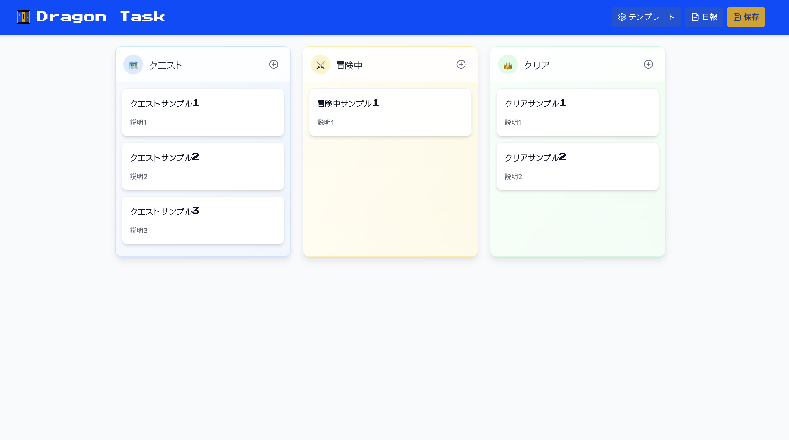
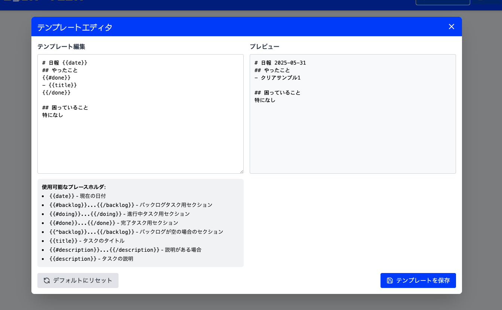

# Quest-like Simple Kanban - ローカルファースト超軽量RPG風Kanbanボード

🐉 ドラゴンクエスト風UIを持つ、ブラウザ完結型のタスク管理アプリケーションです。  
ローカルストレージを使用したオフライン完結型で、RPGクエスト風の楽しいUI/UXでタスク管理をゲーム化します。

## 📸 スクリーンショット

### メインボード画面


### 日報生成機能


### テンプレートエディタ


## ✨ 主要機能

### 🎮 RPGテーマによるゲーム化体験
- **クエストボード**: Backlog → 「クエスト」、Doing → 「冒険中」、Done → 「クリア」
- **レトロフォント**: Press Start 2P/DotGothic16による8-bit風デザイン
- **RPGカラーパレット**: ロイヤルブルー、ゴールド、スレートグレーの統一感ある配色
- **ドラクエ風UI**: ゲームメニューを模したカードデザインとボタン配置

### 🔊 8-bit効果音システム
- **インタラクティブ音響**: タスク操作に応じたレトロゲーム風効果音
  - **タスク追加音**: 新しいクエスト登録時
  - **タスク移動音**: レーン間移動・並び替え時
  - **タスク削除音**: クエスト取り消し時
  - **クリアファンファーレ**: タスク完了時の特別な達成音
- **音量調整**: 4段階の音量設定（オフ/低/中/高）
- **ワンクリック設定**: ヘッダーの音量ボタンで簡単切り替え
- **音声プリロード**: 遅延なしの高速音声再生

### 📋 高度なタスク管理機能
- **スマートタスク追加**: 各カラムから直接タスク追加可能なモーダル
- **詳細編集機能**: タイトル（100文字）+ 説明（500文字）の充実したデータ入力
- **リアルタイム文字数カウント**: 入力制限の可視化
- **ドラッグ&ドロップ**: @dnd-kitによるアクセシブルな操作性
- **キーボードショートカット**: 
  - `Ctrl/Cmd + K`: タスク追加モーダルを開く
  - `Ctrl/Cmd + Enter`: モーダル内でタスクを保存
  - `Escape`: モーダルを閉じる

### ⚡ パフォーマンス最適化
- **デバウンス自動保存**: 操作から300ms後の自動保存でストレス軽減
- **React最適化**: `React.memo`、`useCallback`による再レンダリング最小化
- **状態管理最適化**: Zustandによる効率的なstate管理
- **音声最適化**: Web Audio APIによるネイティブ音声処理

### 🛡️ セキュリティ強化機能
- **XSS対策**: 全入力データの自動サニタイゼーション
- **HTMLエスケープ**: 表示時の自動エスケープ処理
- **データ検証**: LocalStorage保存前の厳密な妥当性チェック
- **ストレージ監視**: 容量制限監視と安全な保存処理
- **CSP対応**: Content Security Policyによる追加保護

### 💾 ローカルファーストデータ管理
- **完全オフライン**: 外部サーバー・API不要の自己完結型
- **プライバシー保護**: データ外部送信なし、完全なローカル管理
- **容量最適化**: 効率的なデータ構造と圧縮保存
- **データ復旧**: 破損時の自動復旧機能

### 📄 高度な日報生成システム
- **Mustacheテンプレート**: カスタマイズ可能な日報フォーマット
- **自動データ注入**: タスク状況の自動反映
- **ワンクリックコピー**: 生成結果の即座クリップボード転送
- **テンプレートエディタ**: リアルタイムプレビュー機能

### 🎯 UX/UIの細部へのこだわり
- **ホバーエフェクト**: 全ボタン・カードの反応性向上
- **トランジション**: 滑らかなアニメーション効果
- **レスポンシブ対応**: モバイル・タブレット・デスクトップ完全対応
- **アクセシビリティ**: WCAG AA準拠のキーボード操作・スクリーンリーダー対応

## 🛠 技術スタック・アーキテクチャ

### フロントエンド
- **React 18**: 最新のfiberアーキテクチャとConcurrent機能
- **TypeScript**: 厳密な型安全性によるバグ防止
- **Vite**: 高速な開発サーバーとHMR

### UI/UX
- **Tailwind CSS**: Utility-firstによる高速スタイリング
- **Lucide React**: 美しいアイコンライブラリ
- **カスタムRPGテーマ**: 独自の8-bit風デザインシステム

### 状態管理・データ
- **Zustand**: 軽量で使いやすい状態管理ライブラリ
- **@dnd-kit**: アクセシブルなドラッグ&ドロップ実装
- **nanoid**: 軽量で安全なID生成

### ユーティリティ・機能
- **Mustache**: 日報テンプレートエンジン
- **Web Audio API**: ブラウザネイティブ音声再生
- **LocalStorage**: セキュアなローカルデータ永続化

### 開発・テスト環境
- **ESLint**: コード品質保持
- **Playwright**: E2Eテスト自動化
- **Vitest**: 高速ユニットテスト
- **Testing Library**: Reactコンポーネントテスト

## 🚀 セットアップ・開発ガイド

### クイックスタート
```bash
# 依存関係のインストール
npm install

# 開発サーバー起動（ホットリロード有効）
npm run dev

# ブラウザで確認
# → http://localhost:5173
```

### ビルド・デプロイ
```bash
# 本番ビルド
npm run build

# ビルド結果確認
npm run preview

# コード品質チェック
npm run lint
```

### テスト実行
```bash
# ユニットテスト
npm run test

# E2Eテスト（ヘッドレス）
npm run test:e2e

# E2EテストUI版
npm run test:e2e:ui

# 全テスト実行
npm run test:all
```

## 📁 プロジェクト構成

```
quest-like-simple-kanban/
├── src/
│   ├── components/          # Reactコンポーネント
│   │   ├── Header.tsx       # ヘッダー（音量設定、日報ボタン）
│   │   ├── Board.tsx        # メインKanbanボード
│   │   ├── Column.tsx       # 各レーン（クエスト/冒険中/クリア）
│   │   ├── TaskCard.tsx     # 個別タスクカード
│   │   ├── TaskEditorModal.tsx  # タスク追加・編集モーダル
│   │   ├── ReportModal.tsx      # 日報生成モーダル
│   │   └── TemplateEditorModal.tsx  # テンプレート編集
│   ├── store/               # Zustand状態管理
│   │   ├── useTaskStore.ts  # タスク管理ストア
│   │   ├── useAudioStore.ts # 効果音設定ストア
│   │   └── useReportStore.ts # 日報管理ストア
│   ├── types/               # TypeScript型定義
│   │   └── task.ts          # タスク関連型
│   ├── utils/               # ユーティリティ関数
│   │   ├── audio.ts         # 音声再生機能
│   │   ├── reportGenerator.ts # 日報生成エンジン
│   │   └── security.ts      # セキュリティ機能
│   └── ...
├── public/                  # 静的アセット
│   ├── *.mp3               # 効果音ファイル
│   ├── quest-board-logo.*  # アプリロゴ
│   └── terms-of-service.md # 利用規約
├── e2e/                    # E2Eテスト
├── docs/                   # ドキュメント
└── ...
```

## 🎮 RPGテーマ・デザインシステム

### カラーパレット
```typescript
const colors = {
  primary: {
    royal: '#1e3a8a',    // ロイヤルブルー（メイン）
    gold: '#fbbf24',     // ゴールド（アクセント）
    slate: '#334155'     // スレートグレー（背景）
  },
  rpg: {
    health: '#ef4444',   // HP赤
    mana: '#3b82f6',     // MP青  
    exp: '#10b981',      // EXP緑
    legendary: '#a855f7' // レジェンダリー紫
  }
}
```

### フォント設定
```css
/* メインフォント: レトロゲーム風 */
.font-pixel { font-family: 'Press Start 2P', 'DotGothic16', monospace; }

/* 読みやすさ重視箇所 */
.font-readable { font-family: 'DotGothic16', 'Hiragino Sans', sans-serif; }
```

## 🔊 音響システム詳細

### 効果音ファイル
- `add-task.mp3` (9.9KB) - タスク追加音
- `move.mp3` (7.0KB) - タスク移動音  
- `delete.mp3` (9.1KB) - タスク削除音
- `fanfare.mp3` (32KB) - クリア時ファンファーレ

### 音量設定
- **オフ**: 完全無音
- **低**: 25%音量
- **中**: 50%音量（デフォルト）
- **高**: 100%音量

## 🛡️ セキュリティ仕様

### 実装済み対策
- **XSS防御**: 全入力の自動サニタイゼーション
- **HTMLエスケープ**: 表示時の安全なレンダリング
- **データ検証**: スキーマベースの入力検証
- **CSP準拠**: Content Security Policy対応
- **ローカルのみ**: 外部通信なしの完全分離

### セキュリティチェックリスト
- [ ] 入力データのサニタイゼーション
- [ ] 出力時のHTMLエスケープ  
- [ ] LocalStorageの容量監視
- [ ] 依存関係の脆弱性チェック (`npm audit`)

## 📱 ブラウザ対応・動作環境

### 推奨ブラウザ
- **Chrome**: 最新版（最適化済み）
- **Firefox**: 最新版
- **Safari**: 最新版  
- **Edge**: 最新版

### 必要な機能
- **LocalStorage**: データ永続化
- **Web Audio API**: 効果音再生
- **ES2020+**: モダンJavaScript機能
- **CSS Grid/Flexbox**: レスポンシブレイアウト

## 🔧 カスタマイズ・拡張

### 効果音の追加・変更
```typescript
// src/utils/audio.ts
export const playCustomSound = (filename: string) => {
  // カスタム音声ファイルの再生実装
}
```

### 新しいカラムの追加
```typescript
// src/types/task.ts で TaskStatus を拡張
export type TaskStatus = 'backlog' | 'doing' | 'done' | 'archived';
```

### 日報テンプレートのカスタマイズ
```mustache
# カスタム日報テンプレート例
## {{date}} のクエスト報告

### 🏆 クリアしたクエスト
{{#done}}
- ⚔️ {{title}} {{#description}}({{description}}){{/description}}
{{/done}}

### ⚡ 現在冒険中
{{#doing}}  
- 🛡️ {{title}} {{#description}}({{description}}){{/description}}
{{/doing}}
```

## 🐛 トラブルシューティング

### よくある問題
1. **音が出ない**: ブラウザの音声ポリシー → ユーザーアクションが必要
2. **保存されない**: LocalStorage無効 → ブラウザ設定確認
3. **動作が重い**: メモリ不足 → ブラウザ再起動
4. **レイアウト崩れ**: キャッシュ問題 → 強制リロード

### デバッグ手順
```bash
# 1. 開発者コンソールでエラー確認
F12 → Console タブ

# 2. LocalStorageの内容確認  
Application → LocalStorage → localhost

# 3. 依存関係の整合性確認
npm run lint

# 4. テスト実行でバグ特定
npm run test:all
```

## 📊 ライセンス・貢献

このプロジェクトはMITライセンスで公開されています。  
バグ報告・機能提案・プルリクエストを歓迎します。

### 貢献ガイドライン
1. **Issue作成**: バグ報告・機能提案
2. **フォーク**: リポジトリのフォーク
3. **ブランチ作成**: `feature/新機能名` 形式
4. **テスト**: `npm run test:all` でテスト通過確認
5. **プルリクエスト**: 詳細な説明と共に提出

---

**🐉 Epic Quest Management - Let's Complete All Tasks! 🗡️**
