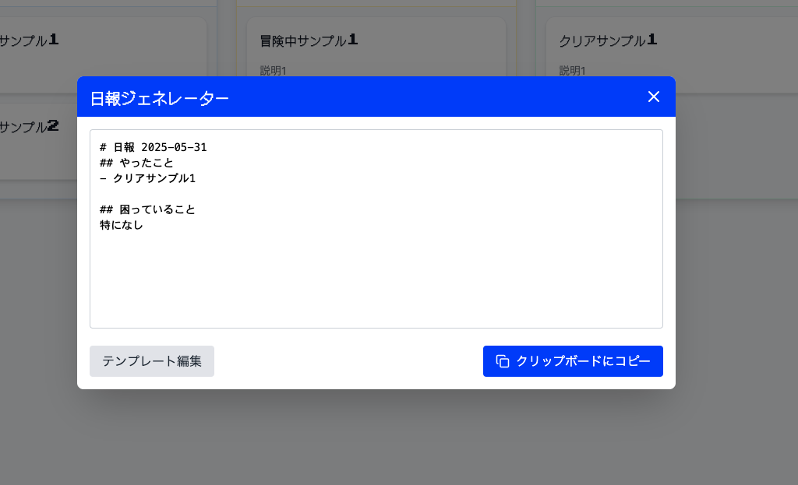

# ローカルファースト超軽量 Kanban ボード

ブラウザのlocalStorageを使用した、オフライン完結型のシンプルなタスク管理アプリです。
明示的に「保存」ボタンを押したときのみデータが永続化される、ユーザー主導型の保存システムを採用しています。

## 📸 スクリーンショット

### メインボード画面

### 日報生成機能

### テンプレートエディタ

## ✨ 主要機能

### 📋 タスク管理
- **タスク登録**: タイトル必須、説明は任意で簡単にタスクを追加
- **3レーン固定ボード**: クエスト（Backlog）→ 冒険中（Doing）→ クリア（Done）
- **ドラッグ＆ドロップ**: 直感的な操作でタスクを移動・並び替え

### 💾 データ管理
- **明示的保存**: ユーザーがSaveボタンを押したときのみlocalStorageに保存
- **オフライン完結**: 外部サーバーやデータベース不要
- **ローカルファースト**: すべてのデータがブラウザ内で完結

### 📄 日報機能
- **自動日報生成**: 現在のタスク状況から日報テキストを自動生成
- **ワンクリックコピー**: 生成した日報をクリップボードに瞬時にコピー
- **テンプレートエディタ**: 日報フォーマットを自由にカスタマイズ可能
- **Mustache形式対応**: `{{date}}`、`{{#backlog}}`などのプレースホルダに対応

## 🎮 RPG風テーマ（オプション）

ドラゴンクエスト風のUI要素で楽しくタスク管理：
- **クエスト系ラベル**: Backlog → クエスト、Doing → 冒険中、Done → クリア
- **レトロフォント**: Press Start 2PまたはDotGothic16を使用
- **8-bitカラーパレット**: ロイヤルブルー、ゴールド、スレートグレーの配色
- **ピクセル風デザイン**: ゲームメニューを模したカードデザイン

## 🛠 技術スタック

- **React 18 + TypeScript**: モダンなフロントエンド開発
- **Vite**: 高速な開発環境
- **Zustand**: 軽量な状態管理
- **dnd-kit**: アクセシビリティ対応のドラッグ＆ドロップ
- **Tailwind CSS**: Utility-firstスタイリング
- **Mustache**: テンプレートエンジン
